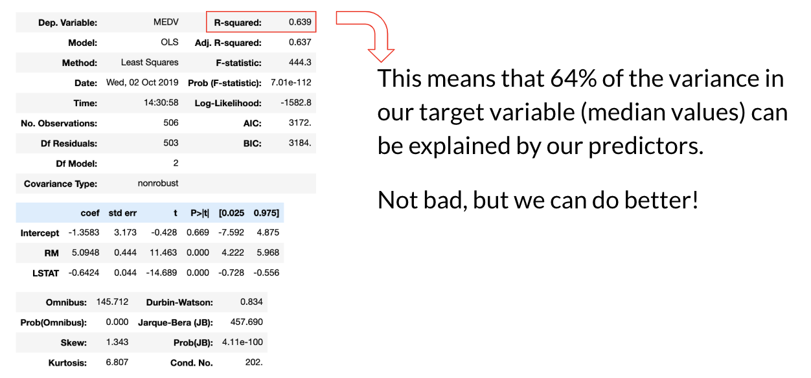
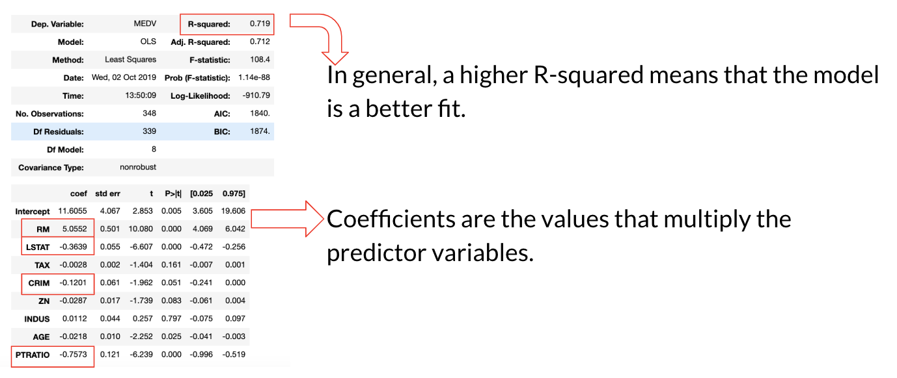

# Regression Analysis of Boston Housing Prices

This is a project to demonstrate a regression analysis implemented in Python. I used the Boston housing dataset, which was imported from scikit-learn. The purpose of this analysis is to determine which features can predict our target variable (median home values).

### Data Exploration

- Choose predictors and target variable
	- Target: median home values (MEDV)
- Look for correlations, remove highly correlated features
- Check for normality

I plotted a heatmap to see correlations.

I first ran a base model without dropping correlated features:

### Final Results

After dropping correlated features and outliers, I ran another model:

We can see that the number of rooms (RM) is the greatest positive predictor for home values.
Crime rate (CRIM), low socioeconomic status (LSTAT), and a high student-to-teacher ratio (PTRATIO) are negative predictors.